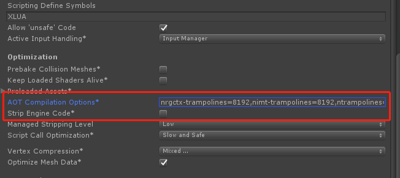
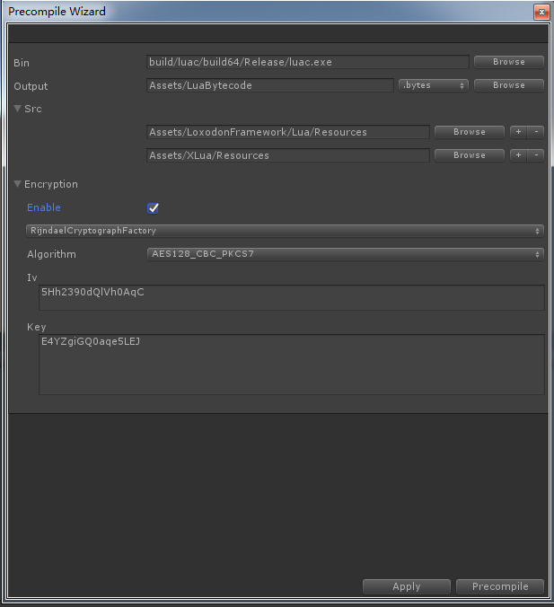

# Loxodon Framework

[(中文版)](README_CN.md)

**MVVM Framework for Unity3D(C# & XLua)**

*Developed by Clark*

Requires Unity 5.6.0 or higher.

LoxodonFramework is a lightweight MVVM(Model-View-ViewModel) framework built specifically to target Unity3D.
Databinding and localization are supported.It has a very flexible extensibility.It makes your game development faster and easier.

For tutorials,examples and support,please see the project.You can also discuss the project in the Unity Forums.

The plugin is compatible with MacOSX,Windows,Linux,UWP,IOS and Android,and provides all the source code of the project.

**Tested in Unity 3D on the following platforms:**  
PC/Mac/Linux  
IOS  
Android  
UWP(window10)

## English manual

- [HTML](https://github.com/cocowolf/loxodon-framework/blob/master/docs/LoxodonFramework_en.md)
- [PDF](https://github.com/cocowolf/loxodon-framework/blob/master/docs/LoxodonFramework_en.pdf)

## Downloads  
- [AssetStore](https://www.assetstore.unity3d.com/#!/content/77446)
- [Releases](https://github.com/cocowolf/loxodon-framework/releases)

## Key Features:
- MVVM Framework;
- Multiple platforms;
- Higher Extensibility;
- XLua support(You can make your game in lua.);
- Asynchronous result and asynchronous task are supported;
- Scheduled Executor and Multi-threading; 
- Messaging system support;
- Preferences can be encrypted;
- Localization support;
- Databinding support:
    - Field binding;
    - Property binding;
    - Dictionary,list and array binding;
    - Event binding;
    - Unity3d's EventBase binding;
    - Static property and field binding;
    - Method binding;
    - Command binding;
    - ObservableProperty,ObservableDictionary and ObservableList binding;
    - Expression binding;
    
## Notes  
- LoxodonFramework supports .Net2.0 and .Net2.0 Subset  
- LoxodonFramework supports .Net4.x and .Net Standard2.0  
- LoxodonFramework supports Mono2x and IL2CPP  
- AOT Compilation Options: "nrgctx-trampolines=8192,nimt-trampolines=8192,ntrampolines=8192" for IOS  
    
    The configuration of trampolines is not necessary now, but in the early versions of Unity3d,if not configured, it will cause the game to crash on the iOS platform.
    
     
     
## Quick Start

Create a view and view model of the progress bar.

    public class ProgressBarViewModel : ViewModelBase
    {
        private string tip;
        private bool enabled;
        private float value;
        public ProgressBarViewModel()
        {
        }

        public string Tip
        {
            get { return this.tip; }
            set { this.Set<string>(ref this.tip, value, nameof(Tip)); }
        }

        public bool Enabled
        {
            get { return this.enabled; }
            set { this.Set<bool>(ref this.enabled, value, nameof(Enabled)); }
        }

        public float Value
        {
            get { return this.value; }
            set { this.Set<float>(ref this.value, value, nameof(Value)); }
        }
    }
	
	public class ProgressBarView : UIView
    {
        public GameObject progressBar;
        public Text progressTip;
        public Text progressText;
        public Slider progressSlider;

        protected override void Awake()
        {
            var bindingSet = this.CreateBindingSet<ProgressBar, ProgressBarViewModel>();

            bindingSet.Bind(this.progressBar).For(v => v.activeSelf).To(vm => vm.Enabled).OneWay();
            bindingSet.Bind(this.progressTip).For(v => v.text).To(vm => vm.Tip).OneWay();
            bindingSet.Bind(this.progressText).For(v => v.text)
                .ToExpression(vm => string.Format("{0:0.00}%", vm.Value * 100)).OneWay();
            bindingSet.Bind(this.progressSlider).For(v => v.value).To(vm => vm.Value).OneWay();

            bindingSet.Build();
        }
    }
    

    IEnumerator Unzip(ProgressBarViewModel progressBar)
    {
        progressBar.Tip = "Unziping";
        progressBar.Enabled = true;//Display the progress bar
        
        for(int i=0;i<30;i++)
        {            
            //TODO:Add unzip code here.
            
            progressBar.Value = (i/(float)30);            
            yield return null;
        }
                
        progressBar.Enabled = false;//Hide the progress bar
        progressBar.Tip = "";        
    }
	
## Plugins
- [Loxodon Framework Localization For CSV](https://github.com/cocowolf/loxodon-framework-localization-for-csv)
  
    It supports localization files in csv format, requires Unity2018.4 or higher.
   
- [Loxodon Framework XLua](https://github.com/cocowolf/loxodon-framework-xlua)

    It supports making games with lua scripts.
    
    - Installation 
        - You can download the latest version of xlua from Xlua's Github repository,the file name is usually xlua_v2.x.xx.zip, unzip and copy it to your project.[XLua Download](https://github.com/Tencent/xLua/releases) 
        
        - Configure a macro definition called "XLUA" in PlayerSetting/Scripting Defin Symbols.It is recommended to configure all platforms.
        
        - Find Loxodon.Framework.XLua.unitypackage in the LoxodonFramework/Docs/XLua directory and import it into the project.

        - **In Unity2018 and above, if you use .net 4.x and .net standard 2.0, there will be compatibility issues. Please see the xlua's FAQs.** [XLua FAQ](https://github.com/Tencent/xLua/blob/master/Assets/XLua/Doc/Faq_EN.md) 
        
        - Please see the example in the LoxodonFramework/Lua/Examples directory to enjoy your lua tour.
    
    - Lua precompilation tool
    
    	
 
- [Loxodon Framework Bundle](http://u3d.as/NkT)
    
    Loxodon Framework Bundle is an AssetBundle manager.It provides a functionality that can automatically manage/load an AssetBundle and its dependencies from local or remote location.Asset Dependency Management including BundleManifest that keep track of every AssetBundle and all of their dependencies. An AssetBundle Simulation Mode which allows for iterative testing of AssetBundles in a the Unity editor without ever building an AssetBundle.
    
    The asset redundancy analyzer can help you find the redundant assets included in the AssetsBundles.Create a fingerprint for the asset by collecting the characteristic data of the asset. Find out the redundant assets in all AssetBundles by fingerprint comparison.it only supports the AssetBundle of Unity 5.6 or higher.

    

- [Loxodon Framework Log4Net](http://u3d.as/Gmr)

    This is a log plugin.It helps you to use Log4Net in the Unity3d.

    
    
- [Json.Net.Aot](https://github.com/Daddoon/Json.NET.Aot)

    This implementation is actually a fork of the excellent work of SaladLab, Json.Net.Unity3D, and of course, the excellent work of the initial author, Newtonsoft!
    
- [LiteDB](https://github.com/mbdavid/LiteDB)

    LiteDB is a small, fast and lightweight NoSQL embedded database.
    
- [SQLite4Unity3d](https://github.com/robertohuertasm/SQLite4Unity3d)

    When I started with Unity3d development I needed to use SQLite in my project and it was very hard to me to find a place with simple instructions on how to make it work. All I got were links to paid solutions on the Unity3d's Assets Store and a lot of different and complicated tutorials.

    At the end, I decided that there should be a simpler way and I created SQLite4Unity3d, a plugin that helps you to use SQLite in your Unity3d projects in a clear and easy way and works in iOS, Mac, Android and Windows projects.

    It uses the great [sqlite-net](https://github.com/praeclarum/sqlite-net/) library as a base so you will have Linq besides sql. For a further reference on what possibilities you have available with this library I encourage you to visit its github repository.
    

## Tutorials and Examples

- [Tutorials](https://github.com/cocowolf/loxodon-framework/tree/master/Assets/LoxodonFramework/Tutorials)
- [Examples](https://github.com/cocowolf/loxodon-framework/tree/master/Assets/LoxodonFramework/Examples)

  

  

  

  

## Introduction
- Window View 

   
- Localization 

   
- Databinding 

   
- Variable Example 

   
- ListView Binding 

   

## Contact Us
Email: [yangpc.china@gmail.com](mailto:yangpc.china@gmail.com)   
Website: [https://cocowolf.github.io/loxodon-framework/](https://cocowolf.github.io/loxodon-framework/)  
QQ Group: 622321589 

