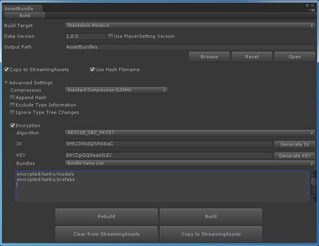
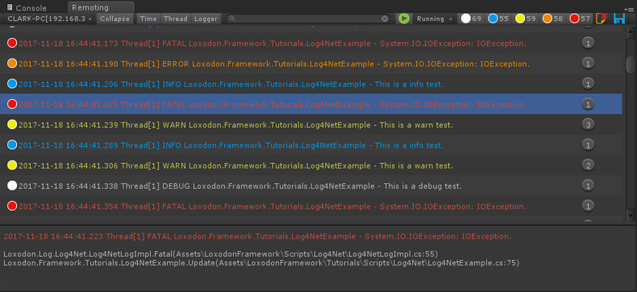
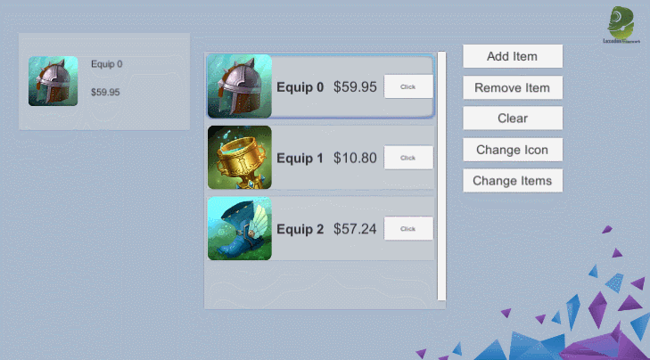
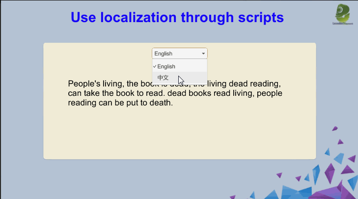
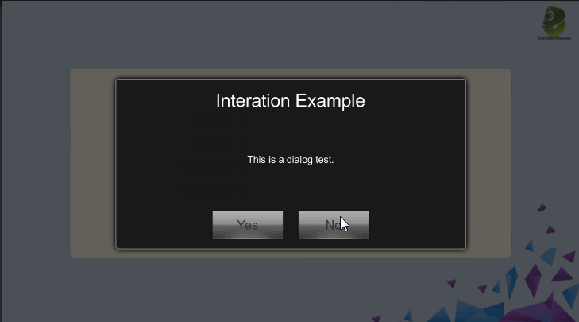

# Loxodon Framework(Unity-MVVM)

[(English)](README.md)

**MVVM and Databinding for Unity3d（C# & XLua & ILRuntime）**

*开发者 Clark*

要求Unity 2018.4 或者更高版本

LoxodonFramework是一个轻量级的MVVM(Model-View-ViewModel)框架，它是专门为Unity3D游戏开发设计的，参考了WPF和Android的MVVM设计，它提供了视图和视图模型的数据绑定、本地化、一个简单的对象容器、配置文件组件、线程工具组件、应用上下文和玩家上下文，异步线程和协程的任务组件等基本组件，同时还提供了一个UI视图的框架。所有代码都基于面向对象面向接口的思路设计，几乎所有功能都可以自定义。而且在数据绑定部分进行了性能优化，避免值类型装箱拆箱，最小化垃圾回收的开销，使用动态委托/静态织入技术确保数据绑定和直接调用有相当的性能，0GC更新UI视图等等，它支持绑定到UGUI、UIToolkit和FairyGUI控件，同时也很容易扩展对其他UI控件的支持。此外，它已经在项目中得到验证（UWA评分SSS级，可在战斗中完全关闭GC，在6、7前手机都保证60FPS），性能优越，稳定可靠，架构清晰，可灵活扩展。 我们希望它能够帮助您更快、更轻松地开发游戏。

本框架使用C#语言开发，同时也支持使用XLua或者ILRuntime来开发，如果项目需要热更新，那么只要安装了XLua或者ILRuntime插件，则可以完全使用Lua或者ILRuntime来开发游戏。对于新立项的项目，建议使用HybridCLR来做热更新。

这个插件兼容 MacOSX,Windows,Linux,UWP,IOS and Android,WebGL等等，并且完全开源。

如果你喜欢这个框架或者觉得它对你来说是有用的，请帮我在[AssetStore](https://assetstore.unity.com/packages/tools/gui/loxodon-framework-2-0-178583#reviews)上写一个评论或者在Github上给一颗星，更多人的参与才是开源作者工作的动力，谢谢！

**已测试的平台：**  
PC/Mac/Linux  
IOS  
Android  
UWP(window10)  
WebGL  

## 安装

自Loxodon.Framework 2.0版本开始，保留了原有的 .unitypackage包发布方式，同时添加了UPM发布方式，此版本要求Unity 2018.4.2及以上版本，框架的目录结构和API都进行了一些调整，同时引入了async/await、Task等新特性，升级前请先查看下文的升级注意事项。

**安装注意：在中国区下载的Unity版本屏蔽了第三方仓库，会导致UPM包安装失败，咨询了Unity中国相关人员说是马上会放开，如果UPM方式安装失败请使用.unitypackage文件安装或者使用非中国区的Unity版本**

### 1.x.x版本升级到2.0注意事项

**从1.x.x版本升级到2.0版本前，请先删除老版本的所有文件，按下面的安装步骤安装新版本。2.0版本的教程和示例代码默认不会自动导入，如需要请手动导入到项目中。**

**Loxodon.Framework.XLua和Loxodon.Framework.Bundle因为依赖问题仍然使用传统方式发布。**

**不兼容的改变：**
- **修改了IUIViewLocator接口以及实现，如果继承了此接口的自定义实现需要调整。**
- **修改了本地化模块的IDataProvider接口及实现，如果没有自定义类，不会有影响。**
- **IAsyncTask和IProgressTask有用到多线程,在WebGL平台不支持，2.0版本后建议不再使用，框架中用到了它们的地方都改为IAsyncResult和IProgressResult。**
- **新的API使用了async/await和Task，不再支持.net 2.0**
- **修改了Window、WindowManager等几个类的函数，改IAsyncTask为IAsyncResult**

详细安装过程请参阅[安装文档](Installation_CN.md)

## 中文文档

- [HTML](https://github.com/vovgou/loxodon-framework/blob/master/docs/LoxodonFramework.md)
- [PDF](https://github.com/vovgou/loxodon-framework/blob/master/docs/LoxodonFramework.pdf)
- [常见问题解答 FAQ](https://github.com/vovgou/loxodon-framework/blob/master/docs/faq.md)

## 关键功能：
- MVVM框架，支持UGUI、UIToolkit和FairyGUI;
- 支持XLua，可以完全使用Lua脚本开发（可选）;
- 支持async&await (C#和Lua都支持);
- Lua支持了try&catch&finally;
- 支持ILRuntime;
- 多平台支持;
- 高扩展性，面向接口开发;
- 运行时委托替代反射（包括IOS平台），尽可能的避免值类型的装箱拆箱;
- 支持线程和协程的异步结果和异步任务，采用Future/Promise设计模式;
- 多线程组件和定时执行器;
- 支持消息系统，订阅和发布事件;
- 支持对象池;
- 支持Properties的配置文件;
- 可加密的配置文件，支持对象存取，可以自定义对象转换器，支持更多的对象;
- 本地化支持，支持xml、csv、asset等多种配置方式，支持图片等多媒体资源本地化;
- 数据绑定支持:
    - 避免了值类型的装箱和拆箱;
    - 使用动态委托/静态织入技术优化性能，避免反射(绑定与直接调用性能相当);
    - 最小化GC分配，避免字符串拼接，避免数字转字符串产生GC;
    - 0GC更新UI视图;
    - Field绑定，只支持OneTime的模式，因无法支持改变通知;
    - 属性绑定，支持TwoWay双向绑定，值修改自动通知;
    - 普通字典、列表绑定，不支持改变通知;
    - 支持C#事件绑定;
    - 支持Unity3D的EventBase事件绑定;
    - 支持静态类的属性和Field的绑定;
    - 支持方法绑定;
    - 支持命令绑定，通过命令绑定可以方便控制按钮的有效无效状态;
    - 支持可观察属性、字典、列表的绑定，支持改变通知，视图模型修改自动更改UI显示;
    - 支持表达式的绑定;
    - 支持类型转换器，可以将图片名称转换为图集中的Sprite

## 注意：  
- .Net2.0 和 .Net2.0 Subset 请使用 1.9.x 版本，2.0版本不在支持
- LoxodonFramework 2.0 支持 .Net4.x 和 .Net Standard2.0  
- LoxodonFramework 2.0 支持 Mono 和 IL2CPP

## 插件与集成（可选）
- [Loxodon Framework OSA](https://github.com/vovgou/loxodon-framework?path=Loxodon.Framework.OSA)

    这个插件是对Unity的列表插件[Optimized ScrollView Adapter](https://assetstore.unity.com/packages/tools/gui/optimized-scrollview-adapter-68436)进行扩展，为ListView和GridView增加了数据绑定功能。

    **注意：本插件依赖[Optimized ScrollView Adapter](https://assetstore.unity.com/packages/tools/gui/optimized-scrollview-adapter-68436)，请在使用前先安装Optimized ScrollView Adapter。**

- [Loxodon Framework TextFormatting](https://github.com/vovgou/loxodon-framework?path=Loxodon.Framework.TextFormatting)

    这是一个基于C#官方库修改的文本格式化插件，它通过扩展StringBuilder的AppendFormat函数，旨在避免在字符串拼接或数字转为字符串时产生垃圾回收（GC）。这样可以提高性能，特别是在对性能要求较高的场景下。

    此外，插件还对Unity的UGUI进行了扩展，引入了两个新的文本控件：TemplateText和FormattableText。这两个控件支持MVVM的数据绑定特性，可以将ViewModel或值类型的对象与控件进行绑定，同时避免了值类型对象的装箱和拆箱，以最大程度地优化垃圾回收(GC)。

    值得注意的是，如果使用Loxodon.Framework.TextMeshPro中的TemplateTextMeshPro或者FormattableTextMeshProUGUI控件，可以进一步减少垃圾回收（GC），完全0GC的更新游戏视图。

- [Loxodon Framework TextMeshPro](https://github.com/vovgou/loxodon-framework?path=Loxodon.Framework.TextMeshPro)

	这个插件主要作用是为AlertDialog和Toast视图提供TextMeshPro的支持，使用TextMeshProUGUI代替UnityEngine.UI.Text，来优化UI视图。

	此外此插件依赖Loxodon.Framework.TextFormatting插件，进一步优化了垃圾收集，使用FormattableTextMeshProUGUI和TemplateTextMeshProUGUI控件更新UI视图完全不会产生垃圾回收(GC)，完全做到0GC更新视图。

    **注意：本插件依赖TextMeshPro**

- [Loxodon Framework Data](https://github.com/vovgou/loxodon-framework?path=Loxodon.Framework.Data)

	此插件支持从Excel文件中导出数据到Json文件、Lua文件或者LiteDB数据库，以及通过Json.Net将数据转为C#对象。推荐使用LiteDB存储配置数据，这是一个轻量级的NoSQL嵌入式数据库，它本身就支持ORM功能、支持BSON格式、支持数据索引功能，使用起来非常方便。

    - [Loxodon.Framework.Data.LiteDB](https://github.com/vovgou/loxodon-framework?path=Loxodon.Framework.Data/Packages/com.vovgou.loxodon-framework-data-litedb)
    - [Loxodon.Framework.Data.Newtonsoft](https://github.com/vovgou/loxodon-framework?path=Loxodon.Framework.Data/Packages/com.vovgou.loxodon-framework-data-newtonsoft)

- [Loxodon Framework Fody](https://github.com/vovgou/loxodon-framework?path=Loxodon.Framework.Fody)

    这是一个静态织入代码的插件，它由多个子插件组成，支持为对象静态织入ToString函数，织入PropertyChanged事件，织入BindingProxy类等，在优化性能的同时也提高开发效率。

    - [Loxodon.Framework.Fody.PropertyChanged](https://github.com/vovgou/loxodon-framework?path=Loxodon.Framework.Fody/Packages/com.vovgou.loxodon-framework-fody-propertychanged)
    - [Loxodon.Framework.Fody.ToString](https://github.com/vovgou/loxodon-framework?path=Loxodon.Framework.Fody/Packages/com.vovgou.loxodon-framework-fody-tostring)
    - [Loxodon.Framework.Fody.BindingProxy](https://github.com/vovgou/loxodon-framework?path=Loxodon.Framework.Fody/Packages/com.vovgou.loxodon-framework-fody-bindingproxy)

- [Loxodon Framework UIToolkit](https://github.com/vovgou/loxodon-framework?path=Loxodon.Framework.UIToolkit)

    此插件将UIToolkit整合到Loxodon.Framework框架中，增加了UIToolkitWindow类，支持数据绑定，支持UIToolkit和UGUI的混用。

- [Loxodon Framework ILRuntime](https://github.com/vovgou/loxodon-framework?path=Loxodon.Framework.ILRuntime)

	Loxodon.Framework.ILRuntime插件为框架增加了对ILRuntime的支持，可以在ILRuntime环境以MVVM的模式开发游戏。同时还可以引入Fody静态织入INotifyPropertyChanged接口，自动为VM对象的属性添加属性改变事件，简化代码编写，具体可以参见我的示例代码。

- [Loxodon Framework Localization For CSV](https://github.com/vovgou/loxodon-framework?path=Loxodon.Framework.LocalizationsForCsv)

    支持本地化文件格式为csv文件格式，要求 Unity2018.4 以上版本.

- [Loxodon Framework XLua](https://github.com/vovgou/loxodon-framework?path=Loxodon.Framework.XLua)

    Loxodon.Framework框架的XLua插件，它是一个lua的MVVM框架，支持lua和c#混合编程或者也可以完全使用lua来编写您的整个游戏。安装步骤详见下一章节或者查看[Loxodon.Framework.XLua的文档](https://github.com/vovgou/loxodon-framework?path=Loxodon.Framework.XLua)    

- [Loxodon Framework Bundle](https://assetstore.unity.com/packages/slug/87419)

    AssetBundle加载和管理的工具，也是一个AssetBundle资源冗余分析工具。它能够自动管理AssetBundle之间复杂的依赖关系，它通过引用计数来维护AssetBundle之间的依赖。你既可以预加载一个AssetBundle，自己管理它的释放，也可以直接通过异步的资源加载函数直接加载资源，资源加载函数会自动去查找资源所在的AB包，自动加载AB，使用完后又会自动释放AB。 它还支持弱缓存，如果对象模板已经在缓存中，则不需要重新去打开AB。它支持多种加载方式，WWW加载，UnityWebRequest加载，File方式的加载等等（在Unity5.6以上版本，请不要使用WWW加载器，它会产生内存峰值）。它提供了一个AssetBundle的打包界面，支持加密AB包（只建议加密敏感资源，因为会影响性能）。同时它也绕开了Unity3D早期版本的一些bug，比如多个协程并发加载同一个资源，在android系统会出错。它的冗余分析是通过解包AssetBundle进行的，这比在编辑器模式下分析的冗余更准确。

    

- [Loxodon Framework FairyGUI](https://github.com/vovgou/loxodon-framework?path=Loxodon.Framework.FairyGUI)

    框架已支持FairyGUI控件的数据绑定，请下载FairyGUI-unity和Loxodon Framework FairyGUI，并导入项目中。

    **下载：**
    [FairyGUI-unity](https://github.com/fairygui/FairyGUI-unity)
    [Loxodon Framework FairyGUI](https://github.com/vovgou/loxodon-framework/releases)  

- [Loxodon Framework NLog](https://github.com/vovgou/loxodon-framework?path=Loxodon.Framework.NLog)

    支持使用NLog在Unity中打印日志，建议使用这个插件替代以前的Log4Net插件，他在日志打印过程中分配更少的堆内存。
- [Loxodon Framework Log4Net](https://github.com/vovgou/loxodon-framework?path=Loxodon.Framework.Log4Net)

    支持使用Log4Net在Unity中打印日志的插件，支持在局域网中远程调试。

    

- [Loxodon Framework Obfuscation](https://github.com/vovgou/loxodon-framework?path=Loxodon.Framework.Obfuscation)

    数据类型内存混淆插件，支持ObfuscatedByte，ObfuscatedShort，ObfuscatedInt,ObfuscatedLong,ObfuscatedFloat,ObfuscatedDouble类型，防止内存修改器修改游戏数值，支持数值类型的所有运算符，与byte、short、int、long、float、double类型之间可以自动转换，使用时替换对应的数值类型即可。
    Float和Double类型混淆时转为int和long类型进行与或运算，确保不会丢失精度，类型转换时使用unsafe代码，兼顾转换性能。

- [Loxodon Framework Addressable](https://github.com/vovgou/loxodon-framework?path=Loxodon.Framework.Addressable)

    有关Addressable Asset System功能的扩展与支持。

- [Loxodon Framework Connection](https://github.com/vovgou/loxodon-framework?path=Loxodon.Framework.Connection)

    这是一个网络连接组件，使用TcpClient实现，实现了Socket连接，自动重连，消息的订阅，事件订阅，请求、响应等操作，支持IPV6和IPV4，使用域名连接时自动识别当前网络，优先连接IPV4网络。使用IPV4地址连接时，自动尝试以``64:ff9b::``为前缀的IPV6地址，如果正确配置NAT64网关，也应该可以连上（未测试）。

    使用本组件之前，需要自定义消息的编码解码器和消息类型，如果协议存在握手消息，请自定义IHandshakeHandler，实现握手功能。

- [DotNetty for Unity](https://github.com/vovgou/DotNettyForUnity)

    DotNetty是著名的java网络库[Netty](https://github.com/netty/netty)的一个C#版本，异步事件驱动网络应用框架，用于快速开发可维护的高性能协议服务器和客户端。  

    这个版本是基于[DotNetty](https://github.com/Azure/DotNetty)的0.7.5版本修改的，是一个为Unity开发平台定制的版本。 它删除了一些依赖库，修复了一些bug，优化了和提升了性能，以适用Unity平台上的游戏开发，并通过了IL2CPP下的测试。

- [LiteDB](https://github.com/mbdavid/LiteDB)

    这是一个NoSQL的嵌入式文档数据库，它完全可以替代SQLite，它由C#语言开发，支持加密，支持ORM，很小巧，性能也不错，有数据库客户端，用它来存储游戏数值配表或者客户端数据存储，它是一个非常不错的选择。

    

- [lua-protobuf](https://github.com/starwing/lua-protobuf)

    lua版本的protobuf解码项目，支持protobuf 3，使用lua开发的同学可以使用这个来解码，推荐。

- [Flatbuffers](https://github.com/google/flatbuffers)

    FlatBuffers是继Protobuf之后，谷歌的另外一个开源的、跨平台的、高效的序列化工具库。它专门为游戏开发或其他性能敏感的应用程序需求而创建。它提供了包括C、C++、C#、java、lua、go、python等等语言的支持，建议大家游戏开发可以选择它作为序列化工具库。

## 快速开始

创建一个进度条的视图和视图模型，并将视图中的UI控件和视图模型绑定，修改视图模型ProgressBarViewModel中的属性，视图UI界面将会自动改变。

    public class ProgressBarViewModel : ViewModelBase
    {
        private string tip;
        private bool enabled;
        private float value;
        public ProgressBarViewModel()
        {
        }

        public string Tip
        {
            get { return this.tip; }
            set { this.Set<string>(ref this.tip, value, nameof(Tip)); }
        }

        public bool Enabled
        {
            get { return this.enabled; }
            set { this.Set<bool>(ref this.enabled, value, nameof(Enabled)); }
        }

        public float Value
        {
            get { return this.value; }
            set { this.Set<float>(ref this.value, value, nameof(Value)); }
        }
    }

    public class ProgressBarView : UIView
    {
        public GameObject progressBar;
        public Text progressTip;
        public Text progressText;
        public Slider progressSlider;

        protected override void Awake()
        {
            var bindingSet = this.CreateBindingSet<ProgressBar, ProgressBarViewModel>();

            bindingSet.Bind(this.progressBar).For(v => v.activeSelf).To(vm => vm.Enabled).OneWay();
            bindingSet.Bind(this.progressTip).For(v => v.text).To(vm => vm.Tip).OneWay();
            bindingSet.Bind(this.progressText).For(v => v.text)
                .ToExpression(vm => string.Format("{0:0.00}%", vm.Value * 100)).OneWay();
            bindingSet.Bind(this.progressSlider).For(v => v.value).To(vm => vm.Value).OneWay();

            bindingSet.Build();
        }
    }

    IEnumerator Unzip(ProgressBarViewModel progressBar)
    {
        progressBar.Tip = "Unziping";
        progressBar.Enabled = true;//Display the progress bar

        for(int i=0;i<30;i++)
        {            
            //TODO:Add unzip code here.

            progressBar.Value = (i/(float)30);            
            yield return null;
        }

        progressBar.Enabled = false;//Hide the progress bar
        progressBar.Tip = "";        
    }

## 教程和示例

 

 

 

 

## 介绍
- 窗口视图示例

  
- 本地化示例

  
- 数据绑定示例

  
- 变量 示例

  
- 列表视图绑定

  

## 联系方式
邮箱: [yangpc.china@gmail.com](mailto:yangpc.china@gmail.com)   
网站: [https://vovgou.github.io/loxodon-framework/](https://vovgou.github.io/loxodon-framework/)  
QQ群: 622321589 15034148
